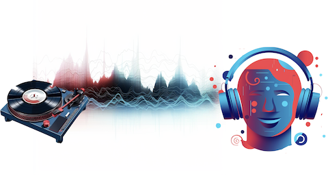
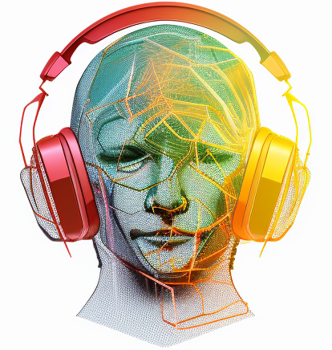
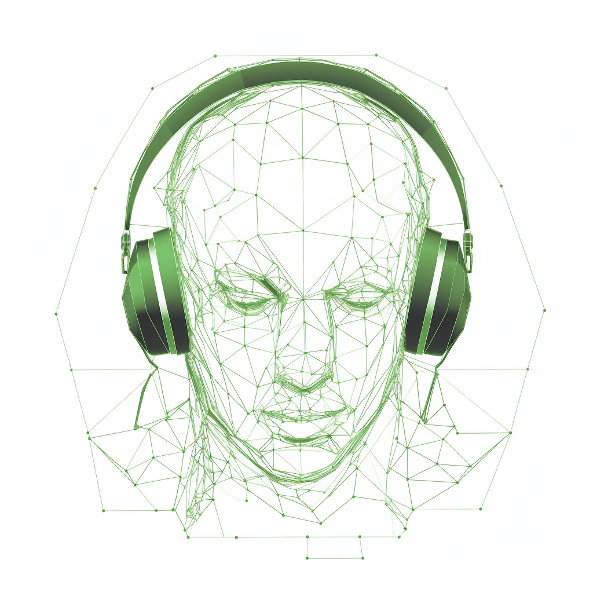
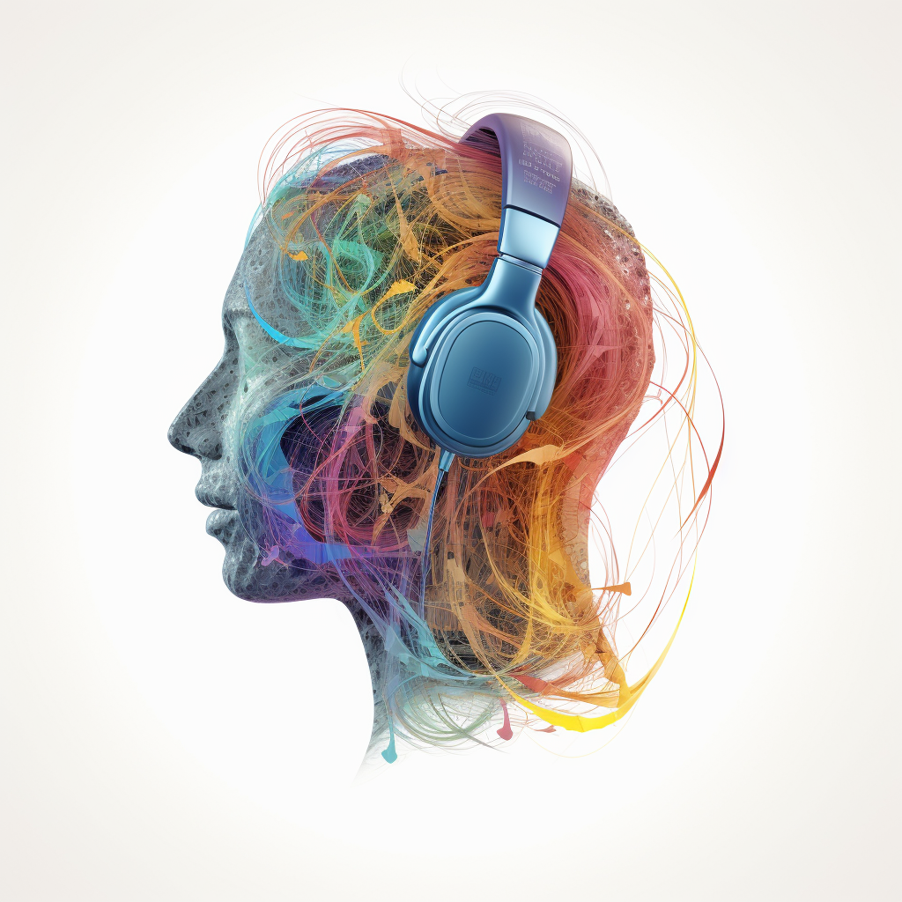

    

Music and emotion research is a multidisciplinary field that explores the complex relationship between music and human emotions. I have explored six themes of interest in this area, namely (i) perception, (ii) induction, and (iii) cultural differences of emotions associated with music, and (iv) theories of emotions, (v) how special emotional experiences such as chills or pleasurable sadness may be generated by listening to music, and (vi) can we predict the emotional expression in music using computers.

### (i) Perception of emotions in music

How do listeners perceive emotions expressed by music? How the specific musical and acoustic cues give rise to specific expressions where we consider music sounding aggressing, tender, nostalgic or sad? In my research I have teased apart the musical acoustic using vast amount of real music ([Eerola, 2011](https://doi.org/10.1080/09298215.2011.602195), [Saari et al., 2015](http://doi.org/10.1109/TAFFC.2015.2462841)) to systematic manipulations of the cues through synthetic examples ([Eerola, et al., 2013](http://doi.org/10.3389/fpsyg.2013.00487); [Grimaud et al., 2022](http://doi.org/https://doi.org/10.1177/20592043211061745)). We have also recently explored what actually are the emotions that people think music can easily express ([Eerola & Saari, 2025](https://journals.plos.org/plosone/article?id=10.1371/journal.pone.0313502)).

### (ii) Induction of emotions by music

How does music elicit emotional responses in us, and what mechanisms and factors influence the emotions (individual differences, cultural background, and musical training)? I've also shown how different individual traits such as personality traits ([Vuoskoski et al., 2011](https://doi.org/10.1177/1029864911403367)) or empathy ([Eerola et al., 2016](http://doi.org/10.3389/fpsyg.2016.01176)), or gender ([Fuentes-Sánchez et al., 2020](https://doi.org/10.1177/0305735620958464)) impact the emotional experiences. 

### (iii) What are the cultural codes for emotional expression in music

What are the cultural codes for emotional expression in music and these are acquired through learning? For perception of emotions in music, we have explored how the same excerpts are interpreted by listeners from different cultures ([Laukka et al., 2013](https://doi.org/10.1037/a0031388)) and how some musical such as mode (major - minor) cues are associated with different emotions in non-Western culture ([Lahdelma et al., 2021](http://doi.org/https://doi.org/10.1111/nyas.14655)).

### (iv) Theoretical frameworks

I have explored whether discrete or dimensional emotion frameworks seem to capture emotion's expressed by music best ([Eerola et al., 2011](http://doi.org/10.1177/0305735610362821)) and how various mechanisms proposed by Patrik Juslin actually influence the emotions triggered by music ([Juslin et al., 2015](http://doi.org/10.5406/amerjpsyc.128.3.0281)), and whether emotional experiences could be seen through a process of construction ([Cespedes-Guevara & Eerola, 2018](https://www.frontiersin.org/article/10.3389/fpsyg.2018.00215); [Lennie & Eerola, 2022](https://doi.org/10.3389/fpsyg.2022.822264)). I am currently engaged in developing more contextualised and situated ways of capturing emotions induced by music. We call this framework the [episode model (Eerola, Kirts, & Saarikallio, 2025)](https://journals.sagepub.com/doi/10.1177/03057356241279763). From this theory, we have developed a set of measurement scales to enable researchers to tackle the contextualised understanding of emotions related to music (see [Kirts et al., 2026](http://doi.org/https://doi.org/10.1177/20592043251413550)).

You can read more about the idea of contextualised and situated emotions related to music in this blog about [context matters for music and emotions](https://tuomaseerola.github.io/context_matters/).

### (v) Special emotions

We have explored some of the special emotional experiences such as _music-induced chills_ and [pleasurable sadness associated with music](https://tuomaseerola.github.io/sadness/), which reveal how nuanced and contextualised emotional experiences associated with music really are. 

### (vi) Computational models of emotions in music

Most of the research topics above have tried to increase how we as listeners process, detect, or experience emotions triggered or induced by music. One way of making the perceptual processes and perception of emotions in music clear is to let computational models either mimic the human process or allow the computer to discover how to discover the emotional signal meaningful to listeners directly from the audio. It is a challenging topic, and while it is not too difficult to train a linear model using some acoustic feature data and ratings of emotions from listeners, what is being modelled (perception) and how (what features, what modelling architectures) is a question that has numerous solutions. Recently, we conducted a meta-analysis of this area of study ([Eerola & Anderson, 2026](https://doi.org/10.1145/3796518)) and there is a [short blog text about it](https://tuomaseerola.github.io/music_emotion_recognition/). There are also applications of the emotion recognition models, and recently I was involved in a fascinating study which used the recognition of emotions from audio to recommend music in Colombia around the time of the last elections, and the recommendations were actually done in the way that showed that it can lead to unethical recommendations (suggesting music that was politically charged), see Gómez-Cañón et al., ([2025](https://doi.org/10.1140/epjds/s13688-025-00595-1)).

### My recent studies related to music and emotions

