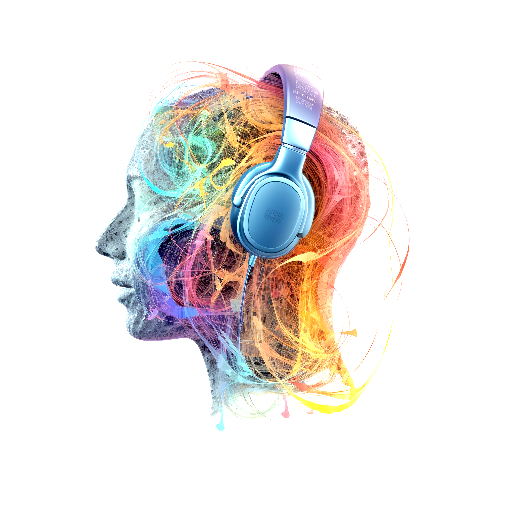

    

Music and emotion research is a multidisciplinary field that explores the complex relationship between music and human emotions. I have explored five themes of interest in this area, namely (i) perception, (ii) induction, and (iii) cultural differences of emotions associated with music, and (iv) theories of emotions, and finally (v) how special emotional experiences such as chills or pleasurable sadness may be generated by listening to music.

### (i) Perception of emotions in music

How do listeners perceive emotions expressed by music? How the specific musical and acoustic cues give rise to specific expressions where we consider music sounding aggressing, tender, nostalgic or sad? In my research I have teased apart the musical acoustic using vast amount of real music ([Eerola, 2011](https://doi.org/10.1080/09298215.2011.602195), [Saari et al., 2015](http://doi.org/10.1109/TAFFC.2015.2462841)) to systematic manipulations of the cues through synthetic examples ([Eerola, et al., 2013](http://doi.org/10.3389/fpsyg.2013.00487); [Grimaud et al., 2022](http://doi.org/https://doi.org/10.1177/20592043211061745)). We have also recently explored what actually are the emotions that people think music can easily express ([Eerola & Saari, 2025](https://journals.plos.org/plosone/article?id=10.1371/journal.pone.0313502)).

### (ii) Induction of emotions by music

How does music elicit emotional responses in us, and what mechanisms and factors influence the emotions (individual differences, cultural background, and musical training)? I've also shown how different individual traits such as personality traits ([Vuoskoski et al., 2011](https://doi.org/10.1177/1029864911403367)) or empathy ([Eerola et al., 2016](http://doi.org/10.3389/fpsyg.2016.01176)), or gender ([Fuentes-Sánchez et al., 2020](https://doi.org/10.1177/0305735620958464)) impact the emotional experiences. 

### (iii) What are the cultural codes for emotional expression in music

What are the cultural codes for emotional expression in music and these are acquired through learning? For perception of emotions in music, we have explored how the same excerpts are interpreted by listeners from different cultures ([Laukka et al., 2013](https://doi.org/10.1037/a0031388)) and how some musical such as mode (major - minor) cues are associated with different emotions in non-Western culture ([Lahdelma et al., 2021](http://doi.org/https://doi.org/10.1111/nyas.14655)).

### (iv) Theoretical frameworks

I have explored whether discrete or dimensional emotion frameworks seem to capture emotion's expressed by music best ([Eerola et al., 2011](http://doi.org/10.1177/0305735610362821)) and how various mechanisms proposed by Patrik Juslin actually influence the emotions triggered by music ([Juslin et al., 2015](http://doi.org/10.5406/amerjpsyc.128.3.0281)), and whether emotional experiences could be seen through a process of construction ([Cespedes-Guevara & Eerola, 2018](https://www.frontiersin.org/article/10.3389/fpsyg.2018.00215); [Lennie & Eerola, 2022](https://doi.org/10.3389/fpsyg.2022.822264)). I am currently engaged in developing more contextualised and situated ways of capturing emotions induced by music. We call this framework the [episode model (Eerola, Kirts, & Saarikallio, 2025)](https://journals.sagepub.com/doi/10.1177/03057356241279763). From this theory, we have developed a set of measurement scales to enable researchers to tackle the contextualised understanding of emotions related to music.

### (v) Special emotions

In addition, I have explored some of the special emotional experiences such as _music-induced chills_ and [pleasurable sadness associated with music](https://tuomaseerola.github.io/sadness/), which reveal how nuanced and contextualised emotional experiences associated with music really are. 

#### My recent studies related to music and emotions

