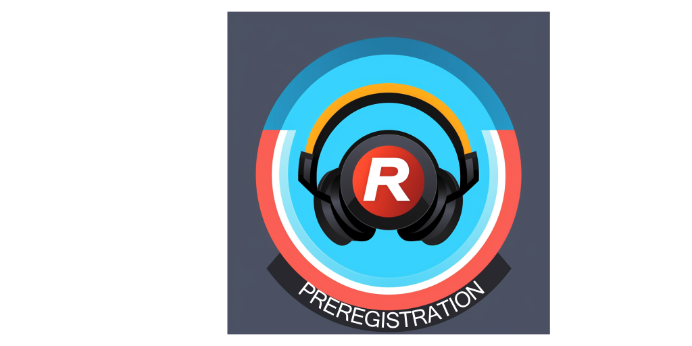
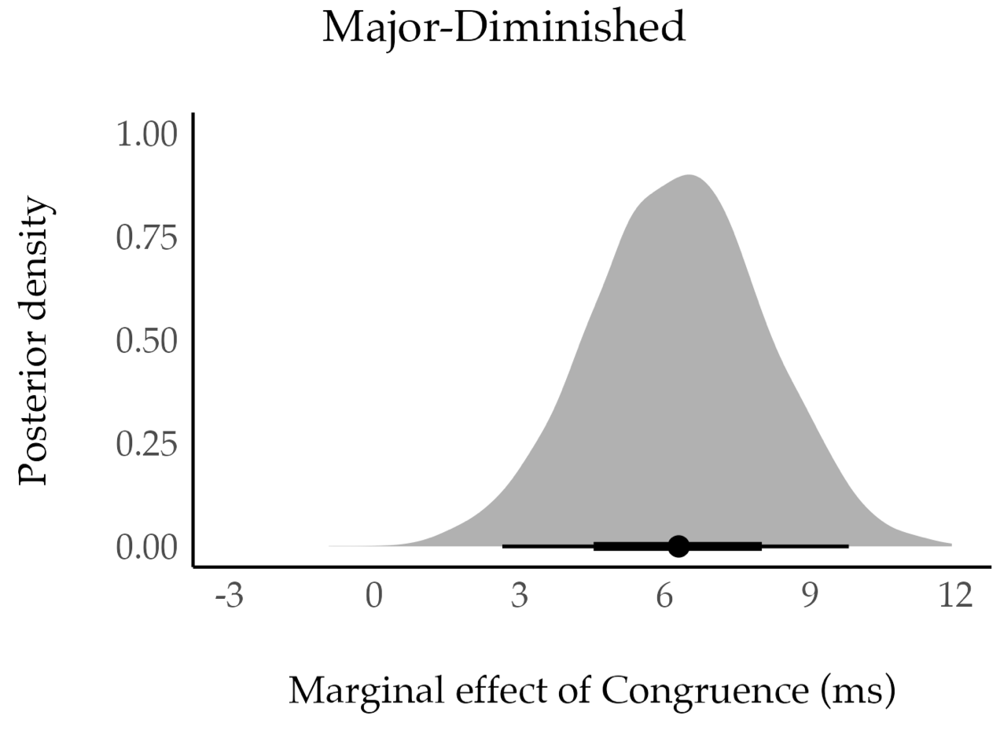
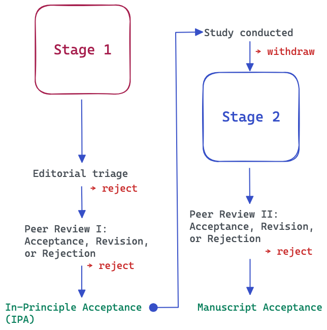

    

    

We are proud to announce the publication of the first **Registered Reported** in _Music Perception_ with our paper titled [Valenced Priming with Acquired Affective Concepts in Music: Automatic Reactions to Common Tonal Chords](https://online.ucpress.edu/mp).

A **Registered Report** is a special type of publication format that takes the open science requirements to the maximum level; a detailed research plan is subjected to peer review before any data is collected. The purpose is to ensure that the methods, hypotheses, and analysis steps are defined to avoid any cherry-picking, p-hacking, and revision of the hypothesis after the results are known. In short, the purpose is to promote transparency of research and also allow publishing results no matter what the outcome is and thus also avoiding the bias of publishing only positive findings. 

In our case, we wrote every part of the research plan down and publicly preregistered them on [OSF](https://osf.io/x8yvk). The idea was to use an objective way of measuring the impact of sounds through the affective priming paradigm, and pit sounds that can be associated with either positive or negative affects against positive or negative words. If the sound and word are _congruent_ (say a minor chord and word such as "morgue"), a participant will quickly be able to classify the word "morgue" as negative. If the sound is positive (say a major chord) but a word is negative, this incongruence between sound and word is visible in the slower decision making process, indexed with reaction time. This method is not impacted by conscious thinking and has provided solid results in psychology since the 1970s. We have applied it to intervals and chords and shown that consonance and dissonance via acoustic roughness is able to bring measurable differences through affective priming ([Armitage et al., 2021](https://doi.org/10.1121/10.0005623), [Lahdelma et al., 2020](https://doi.org/10.1177/10298649209111)).

In the past, roughness contrasts (e.g., dissonant m2 vs consonant P5 intervals) have always driven the responses of affective priming studies. In the present study, we examined what happens when chords that cannot be distinguished by roughness but still have strong cultural connotations that make them opposite in character are placed in an affective priming paradigm.. For instance, the diminished chord is a well-known symbol of something sinister in Western music, whereas the major chord is regarded as positive, although these two chords are not substantially different in their roughness. We pitted 4 pairs of such chords (Major-Minor, Major-Augmented, Major-Diminished, and Major-Suspended 4) against each other in four experiments and predicted the outcome for the affective priming based on past findings. This suggested that the first three pairs should be distinguished in the affective priming paradigm but we have no reason to believe that the Major-Suspended 4 pair produces different responses as Sus 4 is not really a negative sign in Western culture despite its dissonance).

{: width="50%"}

This plan was submitted to peer review in Music Perception (link). After receiving the feedback, we addressed the points raised by three expert reviewers to the plan, and then after getting the approval for our changes, we finally collected (N=400) and analysed the data according to the plan. We then found out that three out of four hypotheses were supported. As committed in the plans, we made the data and the analysis scripts available at [Github](https://github.com/tuomaseerola/cultural_priming). We completed the report, and again the experts checked whether we honoured the commitments made in the preregistration, and after this process was completed, the paper was finally published. My co-author Imre Lahdelma has written [in more detail about the results](https://musicscience.net/2023/01/16/nemur-7-a-day-of-interdisciplinarity-and-collaboration/). 

{: width="50%"}

## Registered Report: Is it worth the effort?

As you can see from the description above, publishing a preregistered study takes more effort than a conventional study. This raises the question, is it worth the time and energy? Remember that it took us 19 months to get this project from the pregistration stage to actual publication.

To consider this properly, we must talk about the reasons behind this transparency initiative. It relates to crisis of credibility of scientific work, which raised its head already nearly 18 years ago ([Ioannidis et al., 2005](https://doi.org/10.1371/journal.pmed.0020124)) and reached the peak crisis in psychology 8-10 years ago ([Simmons et al., 2011](https://doi.org/10.1177/0956797611417632)), when different meta-research efforts concluded that the research is not very robust, a much of it cannot be replicated, and majority does not have the evidence available for future generations ([OSC, 2015](https://doi.org/10.1126/science.aac4716)). This is a problem for music psychology, which has not really seen much improvements in transparency and only relatively few replication studies (I have concrete data on this based on an analysis of hundreds of published articles in our field, but I'll save this for a later occasion).

There are many solutions that would improve the current situation. We can all go beyond null hypothesis testing and switch to CIs and Bayesian statistics to avoid just seeking those p-values below the frequentist conventions (e.g., p<.05). But a more effective strategy could be to release the data and share the code. We should also conduct more replication studies and engage in pre-registering our studies. We can agree that all these changes would lead to improvements but why are they not embraced? Well, it is human nature, we don’t want to engage in operations that take more effort from us, and meta-research has shown that we neglect these principles in practice ([Hardwicke, 2019](https://doi.org/10.31222/osf.io/6uhg5)).

In our field, I have not yet seen preregistered studies published, but we can also take a look at how many studies have been preregistered at OSF. By the end of year 2022, there were 75 registrations (1 in 2017, 3 in 2018 and 2019, 10 in 2020, 24 in 2021, 34 in 2022) so we are clearly seeing an increase (and shout out to Caitlyn Trevor, Pat Savage, and to Imre Lahdelma who have the most amount of preregistrations in OSF in our field). However, at the same time some of these preregistrations will never appear in print, which also tells a story about the topics that have worked if someone takes a close look at these.

### My experiences about preregistering studies

So far, we have had three full papers going through the preregistration study route, one published in _Auditory Perception & Cognition_ ([Armitage & Eerola, 2022](https://doi.org/https://doi.org/10.1080/25742442.2022.2087451)), another in _Psychonomic Bulletin & Review_ ([Eerola & Lahdelma, 2021](https://doi.org/10.3758/s13423-021-02033-5)), and the present Registered Report in _Music Perception_.

#### The positives -- quality improvements and working collaboratively with reviewers

Putting the study plan together with the mindset that I will publicly commit to every step of the plan does improve the quality of planning; you define the concepts and operations clearly, your design does not allow room for interpretation, you specify the measures, the analysis operation, and this forces you to test whether the outcome measures and the design you have proposed is actually providing an answer to the question you set out to resolve. 

The review experience has been largely positive. In preregistration, there is less at stake because there is no data yet and no one is trying to infer one narrative out of the data. If reviewers have different agendas or pet theories, they can attempt to highlight the importance of them and if they spot flaws in the methods, design, or analysis methods, they can helpfully point them out and actually improve the study, unlike in the traditional manuscript, where the research is already committed to the potentially flawed principle, which then becomes a matter of hot debate. In all three cases, the reviewers have virtually turned into collaborators when they have suggested improvements and this feeling you get from first suggesting something and then seeing that being implemented at the study design stage is quite reassuring and disarming. In one case the reviewers suggested an additional control experiment just to be able to rule out an alternative explanation, which we incorporated, and the reviewers were then more than curious to see how their recommendations panned out. For me, this way of getting on the same side of the research with leading experts is the greatest advantage of preregistering your study; peer review is a stressful, slow, and slightly chaotic part of our work and if this allows other people to guide you and agree with your plans before you commit your resources to data, our scholarship is in much better shape.

#### Negatives -- time, energy and emphasis on methods

Preregistration may not take much more time initially when planning, but if you submit the preregistration to peer review, you are adding additional cycles into a process that is already slow. I also have noticed that making a plan that you are ready to commit publicly does take more time than the usual research plan as you need to spell out elements (how to discard data, how to transform data, what is the main statistical analysis method and what elements/covariations/variables are considered important) that you would not normally at the planning stage. Quite often deciding those requires justifying the choices based on past studies, and this takes yet more precious time. In our case, we submitted the preregistration in May 2022, obtained the in-principle acceptance (i.e., IPA) in November 2022, and got the paper accepted in October 2023, 17 months later.

Some people also consider that preregistration reveals the study plans to others, and someone may scoop your research idea. I find this unlikely in our field as our field is small and tends to work on separate topics or using slightly different methods or coming from different theoretical perspectives, but if this happens, at least you have a time-stamped document of your plan. Perhaps the major negative, however, is the energy wasted towards this perceived reliability boost of research that may eat up your resources from innovation. Innovation and finding new insights is considered so central in scholarship that getting the same results as before but with more solid or transparent methods is not a good compensation to sacrifice the novelty. But of course preregistration is not inherently against innovation, on the contrary, spelling out the rationale makes the innovation through research questions, design, and methods more clearly articulated, but it might be that the extra steps required in preregistration kills the feeling of creativity and exploration that often propels bold research ideas forward.

It is also worth pointing out that preregistration is not meant for all kinds of research. For instance, explorative research may not really benefit from registered the details of the study. Even if you preregister a study and you decide to explore some aspects of the data afterwards, you are allowed to do it as long as you clearly signpost this in your report.

I would recommend engaging in replication and pre-registration. It should be part of our field, through postgraduate training at least. At Durham, we have integrated replication projects to undergraduate modules for over five years now, which has created excellent new variants of classic studies (documented in our in-house journal, [DURMS](https://musicscience.net/durms/)). The preregistration should also be integrated to journal policies, and at the moment [Music Perception](https://online.ucpress.edu/mp/pages/registered_reports) accepts _Registered Reports_.

The more accountability, transparency and reliability we achieve in our studies, the easier it is for us to demonstrate these qualities to outsiders of our field, and ultimately this quality control should boost our discovery of how music works. We would also do our small part in helping social sciences to shed the reputation of being in crisis of credibility.

#### Recent papers with preregistrations

## References

* Armitage, J., & T. Eerola. (2022). Cross-Modal Transfer of Valence or Arousal from Music to Word Targets in Affective Priming? _Auditory Perception & Cognition_, 5 (3-4), 192–210. [https://doi.org/https://doi.org/10.1080/25742442.2022.2087451](https://doi.org/https://doi.org/10.1080/25742442.2022.2087451).

* Eerola, T., & I. Lahdelma. (2022). Register Impacts Perceptual Consonance Through Roughness and Sharpness. _Psychonomic Bulletin and Review_, 29, 800–808. [https://doi.org/10.3758/s13423-021-02033-5](https://doi.org/10.3758/s13423-021-02033-5).

* Hardwicke, T. E., Joshua D Wallach, Mallory Kidwell, Theiss Bendixen, Sophia Crüwell, and John P. A. Ioannidis. (2019). An Empirical Assessment of Transparency and Reproducibility-Related Research Practices in the Social Sciences (2014-2017), [https://doi.org/10.31222/osf.io/6uhg5](https://doi.org/10.31222/osf.io/6uhg5).

* Ioannidis, J. P. A. (2005). Why Most Published Research Findings Are False. _PLoS Medicine_, 2(8), e124, [https://doi.org/10.1371/journal.pmed.0020124](https://doi.org/10.1371/journal.pmed.0020124).

* Lahdelma, I. & Eerola, T. (2023). Registered Report - Valenced Priming with Acquired Affective Concepts in Music: Automatic Reactions to Common Tonal Chords. _Music Perception_, in press.

* OSC. (2015). Estimating the Reproducibility of Psychological Science. _Science, 349_ (6251): aac4716, [https://doi.org/10.1126/science.aac4716](https://doi.org/10.1126/science.aac4716)

* Simmons, Joseph P, Leif D Nelson, & U Simonsohn. (2011). False-Positive Psychology: Undisclosed Flexibility in Data Collection and Analysis Allows Presenting Anything as Significant. _Psychological Science_, 22 (11), 1359-1366. [https://doi.org/10.1177/0956797611417632](https://doi.org/10.1177/0956797611417632).
