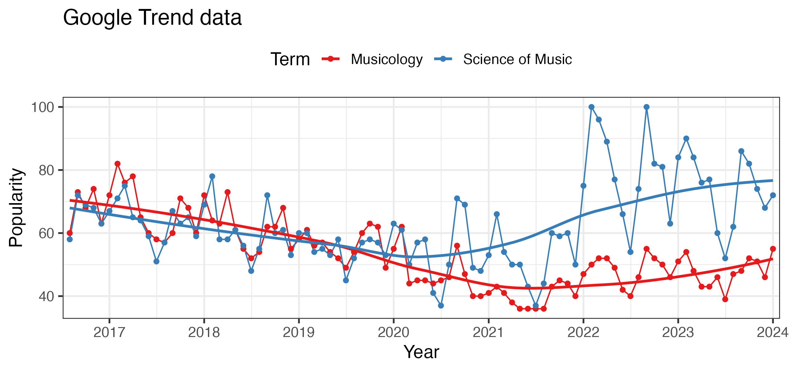

    

I am proud to announce the release of my new textbook in the fields of music and science, and music psychology titled [Music and Science: A Guide to Empirical Research](https://www.taylorfrancis.com/books/mono/10.4324/9781003293804/music-science-tuomas-eerola). This book has grown from a decade of teaching these subjects at [Durham University](https://www.durham.ac.uk/departments/academic/music/).

I had several options for the title of the book. It could have been *A Guide to Empirical Musicology* or *Empirical Music Research* (as part of the title suggests). Alternatively, it might have incorporated terms like *Systematic Musicology*, *Music Cognition*, *Guide to Music Psychology* or *Scientific Musicology*. However, I chose to highlight *music and science* for specific reasons, and in this blog post, I’d like to explain why I made this choice and share some of the motivations behind it.

### Four Reasons Why I Chose "Music and Science" for the title

#### 1. Reflecting Historical Traditions

I wanted the title to reflect the evolving landscape of music research. In Chapter 3, I review the history of music research, musicology, empirical musicology, music cognition, music psychology, and cognitive musicology, drawing on the works of scholars such as [David Huron](https://music.osu.edu/people/huron.1), [Henkjan Honing](https://www.uva.nl/en/profile/h/o/h.j.honing/h.j.honing.html), [Richard Parncutt](https://homepage.uni-graz.at/de/richard.parncutt/), and [Eric Clarke](https://www.music.ox.ac.uk/people/professor-eric-clarke), who all have articulated ideas about the empirical side of music research. Building on their analyses, I present an updated perspective, proposing a shift toward more science-based music research (*scientific musicology*) as distinct from humanities-based music research (*humanistic musicology*). Both perspectives are valuable for a topic such as music, and the distinction itself has roots tracing back to the 19th century. Recent developments in areas like computational musicology and corpus studies have brought such approaches into mainstream discussions in music theory, analysis, and history. I wanted the book to reflect this expanded toolkit available to today’s empirical musicologists and also to reach out to people who may not identify themselves as musicologists or music psychologists but work on digital humanities, psychology, or music information retrieval.

#### 2. Social Media's Role in Standardising Terminology

The term *music and science* has gained traction on social media platforms since 2012, initially on Twitter and now on [Bluesky](https://bsky.app). The hashtag `#musicscience` has become a unifying label, bridging differences between terms like *music cognition* and *systematic musicology*. It allows music researchers and enthusiasts to connect across cultural and disciplinary borders, sharing interests, profiles, studies, and conference updates. The term has organically emerged as a way to overcome debates about naming within the field. If you look at the frequency of the terms in Google Trends, it is apparent that 'musicology' (nor its variants) can compete with popularity of 'science of music' (see chart), although the reason for this is probably not the scholarly interests but rather the rise of data science and wealth of data analytics associated with music (streaming giants and their application programming interfaces, which feature in the book as well).

#### 3. Institutional Support for "Music and Science"

The institutional conventions have also influenced my choice. At Durham University, we have been actively promoting the integration of music and science since 2014 when I co-created an undergraduate module titled *Music and Science* with Nick Collins, followed by the founding of the *[Music and Science Lab](https://musicscience.net)* in 2016 with Kelly Jakubowski. In 2017, we launched an undergraduate journal, titled [DURMS – Durham Undergraduate Research in Music & Science](https://musicscience.net/durms/), dedicated to the same theme. Now the area has expanded into computer science and we have two labs under music and science at Durham, one called _Music Psychology Lab_ and another one titled _Music Computing Lab_ hosted by colleagues ([Eamonn Bell](https://www.durham.ac.uk/staff/eamonn-bell/), [Robert Lieck](https://www.durham.ac.uk/staff/robert-lieck/), and [Brian Bemman](https://www.durham.ac.uk/staff/brian-m-bemman/)) at the Department of Computer Science.

Beyond Durham, the University of Cambridge has housed the well-known [Centre for Music and Science](https://cms.mus.cam.ac.uk) since 2003, now led by [Peter Harrison](https://cms.mus.cam.ac.uk/staff/dr-peter-harrison) after 20 years under [Ian Cross](https://www.mus.cam.ac.uk/directory/ian-cross). Other institutions are also adopting similar terminology, such as the University of Jyväskylä in Finland, which recently renamed its master’s program to [Music and Science](https://www.jyu.fi/en/study-with-us/masters-degree-programmes/masters-degree-programme-in-music-and-science). Clearly, the time is ripe for books embracing this combination of disciplines in their titles as well.

#### 4. Bridging Music Psychology and Computational Musicology

Lastly, I wanted the book’s title to reflect my goal of bringing music psychology and computational musicology closer together. Computational approaches to music are not only valuable for music history but also increasingly relevant for music psychology. Positioning computational music research as an equal partner in empirical music studies required choosing a broad, inclusive term.  

The book emphasizes both traditional empirical music research and computational methods, which often overlap in their interests and methodologies. I argue that to fully understand music – why and how we engage with it — we must consider both the psychological experiences of listeners and the structural qualities of the music they create, perform, and consume.

Only time will tell if *music and science* as a term can carve out its niche in music research during this decade. I hope people not yet familiar with the music research disciplines will find the term useful as I believe the term reflects a broader and more inclusive vision for the field. 
