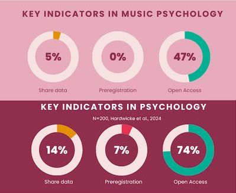
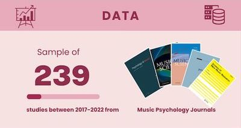

    

I recently published a paper suggesting that music psychology, as a discipline, lacks transparency ([Eerola, 2024](https://doi.org/10.1177/10298649241300885)). This claim was based on a straightforward tally of transparency- and reproducibility-related practices in articles published between 2017 and 2022 in a selection of discipline-specific journals: _Music Perception_, _Psychology of Music_, _Musicae Scientiae_, _Music & Science_, and _Journal of New Music Research_. Similar analyses have been conducted in psychology (see [Hardwicke et al., 2024](https://psycnet.apa.org/doi/10.1177/25152459241283477)). Both studies suggest that, despite numerous efforts to improve research practices since the “transparency crisis” was acknowledged in 2011, the uptake of transparent practices remains limited in both fields.

## Key findings

- **Data Sharing:** While 39% of articles shared *some* research materials (mainly stimuli or instruments), only 5% shared raw data, and just 1% shared analysis scripts. In psychology, the equivalent figures were 14% for data sharing and 9% for analysis scripts ([Hardwicke et al., 2024](https://psycnet.apa.org/doi/10.1177/25152459241283477)).

- **Preregistration:** No preregistrations were found in the sampled articles. In contrast, 7% of the psychology sample included preregistration. I know that pre-registration does exist in music psychology—I've conducted and written about it myself ([Preregistering studies in music and science](https://tuomaseerola.github.io/preregistration/))—but it remains rare. Even when actively searched for, pre-registrations are still the exception rather than the rule.

- **Open Access:** Nearly a half (47%) of the studies are available on Open Access. This is somewhat lower than what psychology studies generally show (74%) but is also dependent on many factors related journal and university policies.

- **Replication Studies:** Replication studies were similarly scarce, accounting for only 3% of the sample. Additional searches (e.g., Scopus and others—insert numbers here) did not yield significantly more replication studies.

These findings indicate that, despite growing awareness and calls for reform, progress in this area has been modest. While I know colleagues who routinely share data (as do I — see [open data]), such practices are far from commonplace in the journals examined.

## First Reactions

The initial reactions from reviewers, conference audiences (e.g. ESCOM), and colleagues on social media ([BlueSky](https://bsky.app/profile/tuomaseerola.bsky.social/post/3ldl66utdm22q)) often challenged the findings: “But we do share our data” and “we also know others who do this”, and “we’ve read several replication studies”. However, this may reflect the *availability heuristic*—the tendency to assume that something is more widespread than it actually is, simply because we can easily recall examples. For every transparent study we remember, there may be twenty that don’t meet even basic standards.

Some might argue that focusing on discipline-specific journals overlooks more transparent work published in generalist or high-impact journals, which often require open practices. However, recent analyses in psychology suggest that the difference between field-wide samples and top-tier journals is generally small. Even if it holds true in some cases, it doesn’t change the fact that, as a discipline, music psychology lacks consistent norms around transparency. Of course the sample might have been larger, but we computed the margin of error as a function of sample size for this type of data ([Rothman & Greenland, 2018](https://doi.org/10.1097/EDE.0000000000000876)), that suggests that these counts are within 5.5% variation of the true population. 

And to clarify, *sharing data* means **functional sharing**—i.e., making data and materials freely available via a public repository with no additional steps. Statements such as “Data available upon reasonable request” do not constitute proper sharing. These requests are known to be inefficient, unreliable, and frequently unanswered ([Tedersoo et al., 2021](https://doi.org/10.1038/s41597-021-00981-0)). This should no longer be accepted by journals. Furthermore, sharing sensitive data—such as clinical, commercially sensitive, or large-scale datasets—is possible with the right protocols (see [Sharing sensitive data openly and safely by Nash, 2024](https://blog.wellcomeopenresearch.org/2024/02/22/sharing-sensitive-data-safely/); [Tamuhla et al., 2023](https://gh.bmj.com/content/8/10/e013092)).

## Implications

These findings suggest that music psychology must strengthen its commitment to open science to enhance the credibility and reproducibility of its research. We can make tangible improvements at multiple levels:

- **Training and supervision** should incorporate pre-registration, data sharing, and code sharing into research planning and publication workflows. There are ample resources and networks available (e.g. [ReproducibiliTea](https://reproducibilitea.org)) to support this and indeed this is now starting to find its way into lab meetings and events.

- **Journals and funding bodies** should play an active role by incentivising and promoting open science. Opting out of transparency should require robust justification. When _Psychological Science_ adopted this policy in 2013, transparency improved steadily: by 2022, 70% of articles had open data and over 40% were preregistered (Bauer, 2023). In 2023, the journal went further: badges were removed, and transparency became a baseline requirement, with all submissions needing to include data, materials, and scripts in public repositories. A dedicated team was also introduced to evaluate statistical rigour, transparency, and reproducibility (the STAR initiative).

- **Scholarly societies** (e.g. [ESCOM](https://www.escomsociety.org/), [ICMPC](https://www.icmpc.org/), [SEMPRE](https://sempre.org.uk/)) can champion transparency through awards, journal policies, training events, and other activities. This has already sparked special focus sessions in SEMPRE events (e.g. [Sempre Autumn Conference 2024 at Hull](https://sempre.org.uk/conference/sempre-autumn-conference-2024-student-study-day/)).

- **Incentive systems** should evolve to credit transparent practices. Currently, academic recognition is still tied to publications rather than open processes. Norway has taken the lead by integrating transparency into merit criteria via [NOR-CAM](https://www.uhr.no/en/_f/p3/i86e9ec84-3b3d-48ce-8167-bbae0f507ce8/nor-cam-a-tool-box-for-assessment-and-rewards.pdf), a framework that includes the principle to “assess all results, activities and competencies in light of Open Science principles”. Notably, music psychology has been part of this movement, with [Alexander Refsum Jensenius](https://www.arj.no) actively promoting these values across Norway and the EU.

- As **individual researchers**, we should reflect on what prevents us from preregistering our next study and making  data and analysis scripts available. These could—and should—become routine and maybe we just need to embed working with GitHub or OSF into our normal research routines. 

## A Modest Starting Point, But Significant Gains Ahead

Transparency in music psychology may not yet be where we want it to be, but at least we now have a solid benchmark to track progress. I’m optimistic: younger researchers are increasingly adopting open practices as part of their training, and some specialist journals are taking steps towards requiring transparency. 

Let’s see where we are in five years. My prediction: we’ll see a significant increase in data and script sharing (up by ~10%), and preregistration rates will reach the current levels seen in psychology (around 7%). We have work to do—but also a clear path forward.

## References

- Bauer P. J. (2023). Attention to authenticity: An essential analogue to focus on rigor and replicability._Psychological Science_. [https://doi.org/10.1177/095679762312208](https://doi.org/10.1177/095679762312208)
- Eerola, T. (2024). Prevalence of transparency and reproducibility-related research practices in music psychology (2017–2022). _Musicae Scientiae_, 1–15. [https://doi.org/10.1177/10298649241300885](https://doi.org/10.1177/10298649241300885)
- Hardwicke, T. E., Thibault, R. T., Clarke, B., Moodie, N., Crüwell, S., Schiavone, S. R., Handcock, S. A., Nghiem, K. A., Mody, F., Eerola, T., & Vazire, S. (2024). Prevalence of transparent research practices in psychology: A cross-sectional study of empirical articles published in 2022. _Advances in Methods and Practices in Psychological Science_, 7(4), 1–13. [https://doi.org/10.1177/25152459241283477](https://psycnet.apa.org/doi/10.1177/25152459241283477)
- Hardwicke, T. E., & Vazire, S. (2023). Transparency Is Now the Default at Psychological Science._Psychological Science_,_35_(7), 708-711. [https://doi.org/10.1177/09567976231221573](https://doi.org/10.1177/09567976231221573)
- Tamuhla, T., Lulamba, E. T., Mutemaringa, T., & Tiffin, N. (2023). Multiple modes of data sharing can facilitate secondary use of sensitive health data for research. _BMJ Global Health, 8(10)_, e013092. https://ghsite-bmj.vercel.app/content/8/10/e013092
- Rothman, K. J., & Greenland, S. (2018). Planning Study Size Based on Precision Rather Than Power. _Epidemiology, 29(5)_, 599–603. https://doi.org/10.1097/EDE.0000000000000876
- Tedersoo, L., Küngas, R., Oras, E., Köster, K., Eenmaa, H., Leijen, Ä., Pedaste, M., Raju, M., Astapova, A., Lukner, H., Kogermann, K., & Sepp, T. (2021). Data sharing practices and data availability upon request differ across scientific disciplines. _Scientific Data_, _8_(1), 192. [https://doi.org/10.1038/s41597-021-00981-0](https://doi.org/10.1038/s41597-021-00981-0)

